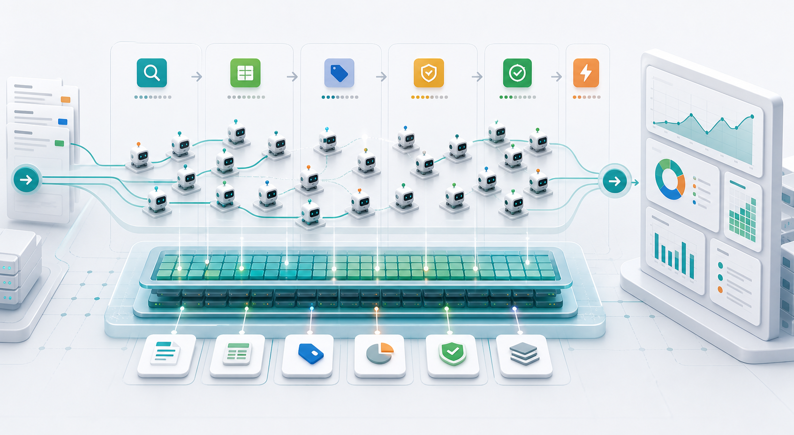
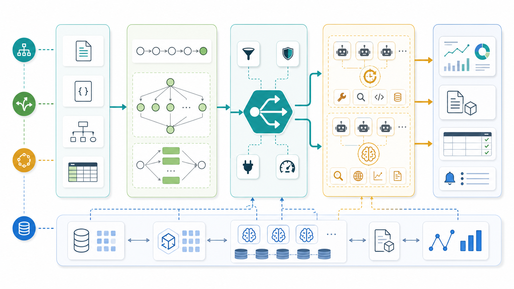
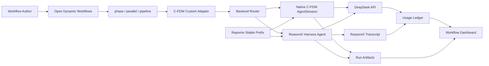

# CFDW: Cache-First Dynamic Workflows



CFDW is a cache-first adapter layer for dynamic AI workflows. It connects
Open Dynamic Workflows style orchestration with DeepSeek prompt-cache metrics,
stable Repomix prefixes, Native C-FDW workers, ReasoniX harness workers, run
artifacts, and a workflow dashboard.

> License note: CFDW is source-available for non-commercial use only. Commercial
> use requires a separate written license. See [LICENSE.md](./LICENSE.md) and
> [NOTICE.md](./NOTICE.md).

## Project Positioning / 项目定位

动态工作流已经证明了它在智能体编排上的效率：它可以把复杂任务拆成多个阶段，让多个 agent 并行探索、交叉验证、汇总产物，并最终形成更高质量的结果。现在动态工作流正在走向开放，技术理应继续流动，让更多人能够使用、理解和改进这种范式。

CFDW 的第一个定位，是把动态工作流做得更好，也让更多人用得起动态工作流。很多真实场景里，成本是限制多 agent 工作流普及的关键因素；而 DeepSeek 的高缓存命中机制、便宜的价格和稳定的性能，给了我们一个新的机会：通过 cache-first 的设计，把动态工作流的运行成本显著降下来，同时保留并行智能体编排带来的效率和价值。

我们公开发布 CFDW，是希望这套能力能够普惠到更多研究者、开发者、团队和非商业项目。动态工作流能做的不只是几个 demo：代码库审计、政策研究、法律冲突挖掘、多城市深度研究、网页证据提取、复杂报告生成，都只是开始。CFDW 的目标，是让这些原本昂贵、复杂、难以观测的 agent workflow，变成可运行、可复用、可观测、可负担的工程系统。

Dynamic workflows have already shown how effective agent orchestration can be:
complex tasks can be split into phases, many agents can explore in parallel,
cross-check each other, hand off artifacts, and synthesize higher-quality
results. As dynamic workflow technology becomes more open, the technology
should keep flowing so more people can use, understand, and improve this
paradigm.

CFDW's first goal is to make dynamic workflows better and more affordable. In
many real deployments, cost is the bottleneck that prevents multi-agent
workflows from becoming widely useful. DeepSeek's high prompt-cache hit
mechanism, low price, and stable performance create a new opportunity: with a
cache-first design, we can substantially lower the cost of dynamic workflows
while keeping the value of parallel agent orchestration.

We are publishing CFDW publicly so this capability can benefit more researchers,
developers, teams, and non-commercial projects. Dynamic workflows can do far
more than the demos in this repository: codebase audits, policy research, legal
conflict mining, multi-city deep research, browser-based evidence extraction,
and complex report generation are only the beginning. CFDW aims to turn these
previously expensive, complex, and hard-to-observe agent workflows into
operational, reusable, observable, and affordable engineering systems.

## What It Does

One workflow `agent()` becomes a cache-stable, observable agent run:

```text
ODW agent(prompt)
-> C-FDW adapter
-> Native AgentSession or ReasoniX harness
-> DeepSeek-compatible model call
-> usage ledger + transcript + artifacts
-> workflow dashboard
```

CFDW is designed for workflows where many agents work across phases, reuse a
stable prefix, hand off structured artifacts, and expose real cache-hit metrics.

## Architecture





## Current Status

Implemented locally:

- `cf-dw-agent`: Native DeepSeek worker with append-only session log.
- `cf-dw-reasonix-agent`: ReasoniX wrapper for ODW custom adapters.
- `cf-dw-prefix`: Repomix-powered stable prefix builder.
- `cf-dw-report`: cache/token usage reports from run ledgers.
- `cf-dw-dashboard`: static workflow execution dashboard.
- ODW real-run demos through both Native C-FDW and ReasoniX backends.

Verified release-demo metrics:

```text
demo workflows = 5
agents         = 23
cache hit      = 200,336 tokens
cache miss     = 24,214 tokens
hit rate       = 89.22%
```

See [docs/demo-benchmark-report-cn.md](./docs/demo-benchmark-report-cn.md).

## Install

```bash
npm install
npm run build
npm run check
```

Create a local `.env`:

```text
DEEPSEEK_API_KEY=...
```

`.env`, transcripts, run artifacts, logs, and local reports are ignored.

## Native Agent

```bash
node dist/index.js `
  --cwd . `
  --prompt "List the top-level files and summarize the project." `
  --cache-group-id cf_dw_local_probe_v1 `
  --session-id agent_001 `
  --max-turns 4
```

Native C-FDW is best for cheap, controlled, lightweight agents:

- classification;
- summary;
- tagging;
- simple JSON conversion;
- read-only file inspection.

## ReasoniX Harness Agent

```bash
node dist/reasonix-agent.js `
  --cwd . `
  --prompt "Inspect README.md and explain what CFDW does." `
  --cache-group-id cf_dw_reasonix_probe_v1 `
  --session-id auto `
  --model deepseek-v4-flash `
  --effort low `
  --budget 0.04 `
  --no-proxy
```

ReasoniX is best for more autonomous, multi-step agents:

- codebase analysis;
- multi-tool tasks;
- complex phase work;
- future CDP/browser workflows;
- high-value synthesis or Pro-routed tasks.

Current wrapper behavior:

```text
one ODW agent = one ReasoniX run = one transcript = one C-FDW session
```

## Build A Stable Prefix

```bash
node dist/prefix-cli.js `
  --cwd . `
  --output .cf-dw/prefix/cache-prefix.xml `
  --style xml `
  --include "src/**/*.ts,README.md,package.json,odw*.json,examples/**/*.js,examples/**/*.json,examples/**/*.md" `
  --compress
```

Use the prefix with the Native agent:

```bash
node dist/index.js `
  --cwd . `
  --prompt-file ./examples/prompts/workspace-summary.md `
  --prefix-file ./.cf-dw/prefix/cache-prefix.xml `
  --cache-group-id cf_dw_workspace_v1 `
  --session-id agent_workspace_001
```

## Run With ODW

Native backend:

```bash
node ../open-dynamic-workflows/dist/cli.js run ./examples/odw-real-demo.js `
  --config ./odw.config.json `
  --runs-root ./.odw/runs `
  --wait `
  --timeout 1200
```

ReasoniX backend:

```bash
node ../open-dynamic-workflows/dist/cli.js run ./examples/odw-reasonix-demo.js `
  --config ./odw.reasonix.config.json `
  --runs-root ./.odw/runs `
  --wait `
  --timeout 900
```

## Dashboard

Generate from a workflow JSON fixture:

```bash
node dist/dashboard.js `
  --workflow-file ./examples/workflows/lexfodra-round3-demo.json `
  --output ./.cf-dw/reports/workflow-dashboard.html
```

Generate from real run artifacts:

```bash
node dist/dashboard.js `
  --runs-root ./.cf-dw/runs `
  --workflow-tag reasonix-odw-demo `
  --latest-per-agent `
  --output ./.cf-dw/reports/reasonix-odw-demo-dashboard.html
```

The dashboard shows:

- workflow title, status, duration, total tokens, total agents;
- phase rows with agent squares and hover context;
- per-agent tokens, tools, cache hit rate, runtime, backend, and artifact path;
- artifact chips from `artifact-manifest.json`;
- optional filtering with `--run-id`, `--since`, and `--latest-per-agent`.

## Demo Suite

The release target is five practical demos:

| Demo | Backend | Purpose | Metrics |
|---|---|---|---|
| [Cache ROI Benchmark](./examples/demos/cache-roi-benchmark.js) | Native + ReasoniX | Run a stable workflow shape and define cold/warm cache gates. | 96.50% cache hit |
| [Codebase Architecture Audit](./examples/demos/codebase-architecture-audit.js) | Native + ReasoniX | Parallel agents inspect modules and synthesize a release report. | 87.65% cache hit |
| [Policy / Legal Conflict Mining](./examples/demos/policy-conflict-mining.js) | ReasoniX | Multi-phase rule extraction, comparison, and conflict scoring. | 88.79% cache hit |
| [Multi-City Deep Research](./examples/demos/multi-city-deep-research.js) | ReasoniX | City/domain fan-out, normalization, comparison, report outline. | 85.16% cache hit |
| [Web/CDP Evidence Extraction](./examples/demos/web-cdp-evidence-extraction.js) | ReasoniX, CDP-ready | Browser evidence playbooks and future CDP artifact protocol. | 85.86% cache hit |

The current Web/CDP demo defines and tests the workflow shape and artifact
protocol. Live CDP browser control is planned for the next implementation stage.

Run the demo suite manually:

```bash
npm run demo:run
```

Regenerate latest-per-agent dashboards without running the live demos:

```bash
npm run demo:dashboards
```

For the current design record, see
[docs/current-design-cn.md](./docs/current-design-cn.md).

## Run Artifacts

Each agent writes under:

```text
<cwd>/.cf-dw/runs/<session_id>/
  result.txt
  session.json
  usage.jsonl
  reasonix-transcript.jsonl
```

The planned artifact-aware adapter will add:

```text
  result.json
  artifact-manifest.json
  artifacts/
    notes.md
    findings.json
    evidence/
    screenshots/
```

## Reports

- [C-FDW 当前设计说明](./docs/current-design-cn.md)
- [C-FDW Adapter MVP 测试记录](./docs/mvp-test-record-cn.md)
- [CFDW 五个 Demo 实测 Benchmark 报告](./docs/demo-benchmark-report-cn.md)
- [CFDW GitHub 发布准备说明](./docs/release-readiness-cn.md)
- [ODW + C-FDW 真实动态工作流运行报告](./docs/odw-real-run-report-cn.md)
- [ReasoniX Harness 接入与试跑报告](./docs/reasonix-harness-run-report-cn.md)

## License

CFDW is source-available for non-commercial use only.

No commercial use is granted by the public license. This includes SaaS,
commercial hosting, paid services, product integration, commercial internal
operations, and commercial benchmarking or model-agent infrastructure use.

See [LICENSE.md](./LICENSE.md).
