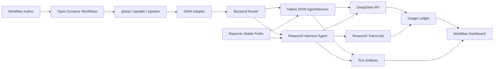

<p align="center">
  
</p>

<p align="center">
  <strong>English</strong> · <a href="./README.zh-CN.md">简体中文</a> · <a href="./README.ru.md">Русский</a>
</p>

# DeepSeek Dynamic Workflow

<p align="center">
  <a href="https://github.com/giao-123-sun/DeepSeek-Dynamic-Workflow/actions/workflows/ci.yml"></a>
  <a href="https://github.com/giao-123-sun/DeepSeek-Dynamic-Workflow/actions/workflows/release-source.yml"></a>
  
  
  
</p>

<p align="center">
  Cache-first dynamic workflows · DeepSeek prompt-cache metrics · agent artifacts · dashboard observability
</p>

<p align="center">
  <b>DDW turns expensive multi-agent workflows into measurable, reusable, low-cost DeepSeek runs.</b><br>
  Fan out agents, keep the prefix warm, pass artifacts across phases, and see cache hits instead of guessing.
</p>

---

**DeepSeek Dynamic Workflow (DDW)** is a cache-first dynamic workflow runtime
for DeepSeek agents. It is built for runs where many agents search, inspect,
verify, compare, and synthesize in parallel while reusing stable context and
leaving behind auditable artifacts.

> Current CLI builds also keep historical `cf-dw-*` commands, the `.cf-dw/`
> runtime directory, and legacy protocol names for compatibility. The project
> name is DeepSeek Dynamic Workflow, abbreviated as DDW.

> License note: DDW is source-available for non-commercial use only. Commercial
> use requires a separate written license. See [LICENSE.md](./LICENSE.md) and
> [NOTICE.md](./NOTICE.md).

## Quick Start

```bash
git clone https://github.com/giao-123-sun/DeepSeek-Dynamic-Workflow.git
cd DeepSeek-Dynamic-Workflow
npm install
npm run build
npm run check
```

Create a local `.env`:

```text
DEEPSEEK_API_KEY=...
```

`.env`, transcripts, run artifacts, logs, dashboards, and local reports are
ignored by git.

## Install With An Agent

Copy this prompt into Codex, Claude Code, Whale, or another coding agent:

```text
Install DeepSeek Dynamic Workflow (DDW) in the current workspace.

Repository: https://github.com/giao-123-sun/DeepSeek-Dynamic-Workflow

Steps:
1. If the repository is not present, clone it. If it is already present, enter it.
2. Run npm install, npm run build, and npm run check.
3. Create .env from .env.example if .env does not exist.
4. Ask me to set DEEPSEEK_API_KEY locally if it is missing. Do not print secrets.
5. Run npm run demo:dashboards to generate local dashboard files when possible.
6. Run npm run release:audit if local demo artifacts are available.
7. Report the install status, any failed command, and the next command I should run.

Do not overwrite unrelated local changes.
```

## Why DDW

动态工作流已经证明了它在智能体编排上的效率：复杂任务可以被拆成多个阶段，让多个 agent 并行探索、交叉验证、传递产物，并最终形成更高质量的结果。随着动态工作流技术走向开源，这种能力也应该继续流动，让更多开发者、研究者和团队能够使用、理解和改进它。

DDW 的定位很直接：**把 DeepSeek 的高缓存命中优势接进动态工作流**。很多真实场景里，成本是限制 multi-agent workflow 普及的关键因素；而 DeepSeek 的高缓存命中机制、低价格和稳定性能，给了我们一个新的工程机会：通过 cache-first 的设计，把动态工作流的运行成本显著降下来，同时保留并行智能体带来的效率和质量。

Dynamic workflows are powerful because they let many agents search, analyze,
verify, and synthesize in parallel. DDW makes that pattern practical by adding a
cache-stable runtime layer, measurable prompt-cache usage, artifact handoff, and
workflow observability.

## At A Glance

| What | Why it matters |
|---|---|
| **Cache-first dynamic workflows** | Stable prefixes keep shared context warm across many agents, so dynamic workflows become cheaper to run repeatedly. |
| **Verified prompt-cache metrics** | Demo runs currently show **88.20% cache hit** across 23 agents, with cache hit/miss recorded per session. |
| **Parallel agent phases** | Fan-out research, multi-perspective review, conflict detection, verification, and synthesis can run as staged workflows. |
| **Artifacts by default** | Each agent can leave transcripts, JSON results, summaries, manifests, and files for downstream phases. |
| **Dashboard observability** | See workflow status, phases, agent squares, tokens, tools, runtime, cache hit rate, and artifact previews. |
| **Autonomous harness when needed** | Lightweight agents can stay cheap; harder agents can run in a tool-capable harness for multi-step work. |

Verified release-demo metrics:

```text
demo workflows  = 5
agents          = 23
reasonix agents = 20
cache hit       = 202,880 tokens
cache miss      = 27,142 tokens
hit rate        = 88.20%
```

See [docs/demo-benchmark-report-cn.md](./docs/demo-benchmark-report-cn.md) and
[docs/token-efficiency-playbook-cn.md](./docs/token-efficiency-playbook-cn.md).

## How It Works

One workflow `agent()` becomes a cache-stable, observable agent run:

```text
ODW agent(prompt)
-> DDW adapter
-> Native DDW AgentSession or autonomous harness
-> DeepSeek-compatible model call
-> usage ledger + transcript + artifacts
-> workflow dashboard
```

DDW is built for workflows where many agents work across phases, reuse a stable
prefix, hand off structured artifacts, and expose real cache-hit metrics.

## Architecture




## Run One Agent

Native DDW is best for cheap, controlled, lightweight agents such as
classification, summary, tagging, simple JSON conversion, and read-only file
inspection.

```bash
node dist/index.js `
  --cwd . `
  --prompt "List the top-level files and summarize the project." `
  --cache-group-id ddw_local_probe_v1 `
  --session-id agent_001 `
  --max-turns 4
```

## Run One ReasoniX Harness Agent

The autonomous harness is best for more multi-step agents: codebase analysis,
multi-tool phase work, future CDP/browser workflows, and high-value synthesis.

```bash
node dist/reasonix-agent.js `
  --cwd . `
  --prompt "Inspect README.md and explain what DDW does." `
  --cache-group-id ddw_reasonix_probe_v1 `
  --session-id auto `
  --model deepseek-v4-flash `
  --effort low `
  --budget 0.04 `
  --no-proxy
```

Current wrapper behavior:

```text
one workflow agent = one harness run = one transcript = one DDW session
```

## Build A Stable Prefix

```bash
node dist/prefix-cli.js `
  --cwd . `
  --output .cf-dw/prefix/cache-prefix.xml `
  --style xml `
  --include "src/**/*.ts,README.md,package.json,odw*.json,examples/**/*.js,examples/**/*.json,examples/**/*.md" `
  --compress
```

Use the prefix with the Native agent:

```bash
node dist/index.js `
  --cwd . `
  --prompt-file ./examples/prompts/workspace-summary.md `
  --prefix-file ./.cf-dw/prefix/cache-prefix.xml `
  --cache-group-id ddw_workspace_v1 `
  --session-id agent_workspace_001
```

## Run With ODW

Native backend:

```bash
node ../open-dynamic-workflows/dist/cli.js run ./examples/odw-real-demo.js `
  --config ./odw.config.json `
  --runs-root ./.odw/runs `
  --wait `
  --timeout 1200
```

ReasoniX backend:

```bash
node ../open-dynamic-workflows/dist/cli.js run ./examples/odw-reasonix-demo.js `
  --config ./odw.reasonix.config.json `
  --runs-root ./.odw/runs `
  --wait `
  --timeout 900
```

## Dashboard

Generate from a workflow JSON fixture:

```bash
node dist/dashboard.js `
  --workflow-file ./examples/workflows/lexfodra-round3-demo.json `
  --output ./.cf-dw/reports/workflow-dashboard.html
```

Generate from real run artifacts:

```bash
node dist/dashboard.js `
  --runs-root ./.cf-dw/runs `
  --workflow-tag reasonix-odw-demo `
  --latest-per-agent `
  --output ./.cf-dw/reports/reasonix-odw-demo-dashboard.html
```

The dashboard shows:

- workflow title, status, duration, total tokens, total agents;
- phase rows with agent squares and hover context;
- per-agent tokens, tools, cache hit rate, runtime, backend, and artifact path;
- artifact chips and expandable previews from `artifact-manifest.json`;
- optional filtering with `--run-id`, `--since`, and `--latest-per-agent`;
- effective token totals using cache-read, cache-miss, and output weights.

## Demo Suite

The release target is five practical demos:

| Demo | Backend | Purpose | Metric |
|---|---|---|---|
| [Cache ROI Benchmark](./examples/demos/cache-roi-benchmark.js) | Native + ReasoniX | Run a stable workflow shape and define cold/warm cache gates. | 90.67% cache hit |
| [Codebase Architecture Audit](./examples/demos/codebase-architecture-audit.js) | Native + ReasoniX | Parallel agents inspect modules and synthesize a release report. | 88.42% cache hit |
| [Policy / Legal Conflict Mining](./examples/demos/policy-conflict-mining.js) | ReasoniX | Multi-phase rule extraction, comparison, and conflict scoring. | 88.79% cache hit |
| [Multi-City Deep Research](./examples/demos/multi-city-deep-research.js) | ReasoniX | City/domain fan-out, normalization, comparison, and report outline. | 85.16% cache hit |
| [Web/CDP Evidence Extraction](./examples/demos/web-cdp-evidence-extraction.js) | ReasoniX, CDP-ready | Browser evidence playbooks and future CDP artifact protocol. | 85.86% cache hit |

The current Web/CDP demo defines and tests the workflow shape and artifact
protocol. Live CDP browser control is planned for the next implementation stage.

Run the demo suite manually:

```bash
npm run demo:run
```

Regenerate latest-per-agent dashboards without running live demos:

```bash
npm run demo:dashboards
```

Verify release gates from local files and real run artifacts:

```bash
npm run release:audit
```

Create a source release archive from committed `HEAD`:

```bash
npm run release:pack
```

The archive is written under `.cf-dw/release/` and excludes local secrets,
runtime logs, dashboards, `dist/`, and dependencies.

## Run Artifacts

Each Native DDW agent writes under:

```text
<cwd>/.cf-dw/runs/<session_id>/
  session.json
  usage.jsonl
```

Each ReasoniX harness agent writes the same observable run envelope plus
artifact-aware handoff files:

```text
<cwd>/.cf-dw/runs/<session_id>/
  session.json
  usage.jsonl
  reasonix-transcript.jsonl
  result.txt
  result.json
  artifact-manifest.json
  artifacts/
    summary.md
```

Demo workflows use `cf-dw.structured-handoff.v1` to pass compact upstream
evidence across phases. The next implementation stage is to make downstream
phases consume structured `artifact-manifest.json` entries directly instead of
concatenating variable natural-language stdout.

## What To Read Next

- [Current design / 当前设计说明](./docs/current-design-cn.md)
- [MVP test record / Adapter MVP 测试记录](./docs/mvp-test-record-cn.md)
- [Demo benchmark report / 五个 Demo 实测 Benchmark 报告](./docs/demo-benchmark-report-cn.md)
- [Release readiness / GitHub 发布准备说明](./docs/release-readiness-cn.md)
- [GitHub release checklist / 发布执行清单](./docs/github-publish-checklist-cn.md)
- [Token efficiency playbook](./docs/token-efficiency-playbook-cn.md)
- [v0.1.0-alpha release notes](./docs/releases/v0.1.0-alpha.md)
- [ODW + DDW real run report / 真实动态工作流运行报告](./docs/odw-real-run-report-cn.md)
- [ReasoniX harness report / ReasoniX Harness 接入与试跑报告](./docs/reasonix-harness-run-report-cn.md)

## License

DDW is source-available for non-commercial use only.

No commercial use is granted by the public license. This includes SaaS,
commercial hosting, paid services, product integration, commercial internal
operations, and commercial benchmarking or model-agent infrastructure use.

See [LICENSE.md](./LICENSE.md).
