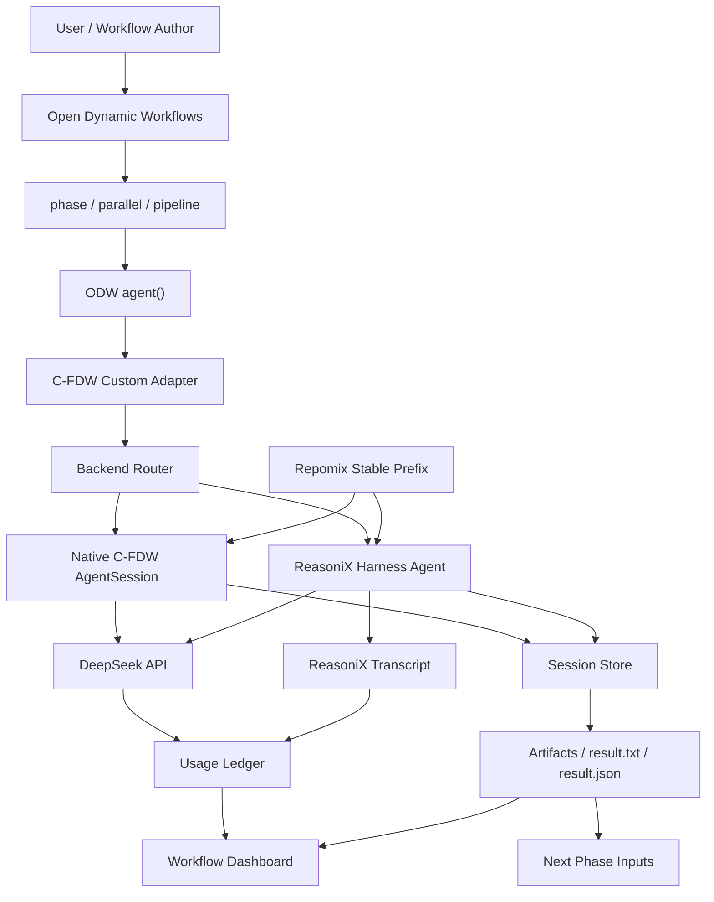

# C-FDW 当前设计说明

**日期**：2026-06-10
**阶段**：版本一 / ODW custom adapter 形态
**当前主线**：ODW 编排 + C-FDW adapter + DeepSeek 贯穿缓存 + ReasoniX per-agent harness + 动态工作流可视化

## 0. 项目定位与开源基调

动态工作流已经证明了它在智能体编排上的效率：它可以把复杂任务拆成多个阶段，让多个 agent 并行探索、交叉验证、汇总产物，并最终形成更高质量的结果。现在动态工作流正在走向开放，技术理应继续流动，让更多人能够使用、理解和改进这种范式。

C-FDW 的第一个定位，是把动态工作流做得更好，也让更多人用得起动态工作流。很多真实场景里，成本是限制多 agent 工作流普及的关键因素；而 DeepSeek 的高缓存命中机制、便宜的价格和稳定的性能，给了我们一个新的机会：通过 cache-first 的设计，把动态工作流的运行成本显著降下来，同时保留并行智能体编排带来的效率和价值。

我们公开发布 C-FDW，是希望这套能力能够普惠到更多研究者、开发者、团队和非商业项目。动态工作流能做的不只是几个 demo：代码库审计、政策研究、法律冲突挖掘、多城市深度研究、网页证据提取、复杂报告生成，都只是开始。C-FDW 的目标，是让这些原本昂贵、复杂、难以观测的 agent workflow，变成可运行、可复用、可观测、可负担的工程系统。

## 1. 一句话定位

C-FDW 是一个 cache-first 的动态工作流 adapter 层。它把 Open Dynamic Workflows 的 `agent()` 节点映射成可观测、可缓存、可替换后端的 agent run，并把每个 agent 的 token、工具调用、缓存命中、耗时、产物和状态沉淀为统一的工作流执行视图。

当前版本的核心判断是：

```text
ODW / C-FDW 负责编排、缓存策略、产物协议和可视化。
ReasoniX 负责复杂 agent 的高自治执行环境。
Native C-FDW agent 负责简单、低成本、强可控的轻量任务。
```

当前 demo workflow 已引入 `cf-dw.structured-handoff.v1`。它把上游 agent 的结果压缩成稳定 JSON handoff：固定版本号、label、item hash、字符数和截断 excerpt。这样 synthesis 阶段不再直接拼接大段自然语言输出，可以降低 prompt drift，也让后续 artifact manifest handoff 更自然地接上。

## 2. 当前已实现状态

已完成的本地能力：

1. `cf-dw-agent`：原生 DeepSeek agent worker。
2. `cf-dw-reasonix-agent`：ReasoniX wrapper，可作为 ODW custom adapter 后端。
3. `cf-dw-prefix`：通过 Repomix 生成稳定 workspace prefix。
4. `cf-dw-report`：统计 run / runs root 的 token、cache hit、cache miss。
5. `cf-dw-dashboard`：生成动态工作流可视化 HTML。
6. ODW 真实接入：已 clone、build 并实际运行 Open Dynamic Workflows。
7. ReasoniX 真实接入：已安装 `reasonix@0.53.2` 并完成 ODW + ReasoniX demo。

当前 release-demo 汇总结果：

```text
demos          = 5
agents         = 23
reasonix agents = 20
cache hit      = 202,880 tokens
cache miss     = 27,142 tokens
hit rate       = 88.20%
```

这里的核心指标不是准确率或召回率，而是贯穿缓存命中、执行成功率、agent 完成率、工具调用稳定性和产物可追踪性。

## 3. 总体架构



## 4. 角色分工

### ODW：编排层

ODW 负责定义 workflow 结构，包括 phase、parallel、pipeline、agent 和 phase 之间的依赖。

它不应该承担缓存、token 统计、ReasoniX 细节、产物规范化这些职责。ODW 的角色更像一个动态工作流骨架：

```text
what to run
when to run
which phase depends on which phase
how many agents can run concurrently
```

### C-FDW：adapter 与观测层

C-FDW 是 ODW 和具体 agent runtime 之间的产品层，负责：

1. 把 ODW `agent()` 调用变成具体 agent run。
2. 注入 cache group、prefix、session id、phase metadata。
3. 记录 usage ledger。
4. 归档 result、transcript、artifact manifest。
5. 生成 dashboard。
6. 在 Native agent 和 ReasoniX agent 之间做路由。

### DeepSeek：模型与贯穿缓存层

DeepSeek 提供模型推理和 prompt cache usage 字段。C-FDW 当前读取：

```text
prompt_cache_hit_tokens
prompt_cache_miss_tokens
prompt_tokens
completion_tokens
total_tokens
```

C-FDW 不依赖 agent 自己汇报缓存命中。所有命中指标必须由系统从 API usage 或 ReasoniX transcript 中读取。

### Repomix：稳定 prefix 层

Repomix 用于把 repo / workspace 的稳定上下文打包成统一 prefix。它的意义是减少 prompt drift，让多个 agent 在相同 workflow 内共享稳定前缀，从而提高贯穿缓存命中。

### ReasoniX：复杂 agent harness

ReasoniX 在当前设计里不是全局编排器，而是每个复杂 agent 的运行环境。它适合：

1. 多步工具任务。
2. 代码库理解与修改。
3. 需要自主策略判断的复杂阶段。
4. 未来 CDP / OpenCLI / web 操作类任务。
5. 需要更强 tool-call repair、成本控制和 transcript 的场景。

当前 wrapper 使用 `reasonix run`，每个 ODW agent 对应一次独立 ReasoniX invocation。后续可以扩展为可 resume 的 persistent session。

### Native C-FDW Agent：轻量 worker

Native worker 适合低复杂度、低成本、强可控任务，例如：

1. 分类。
2. 摘要。
3. 简单 JSON 结构化。
4. 标签生成。
5. 轻量文件读取和 grep。

它的优势是完全可控，缺点是复杂工具循环、修复、策略选择能力需要我们自己补齐。

## 5. 当前运行模型

当前每个 ODW agent 的执行链路是：

```text
ODW agent(prompt)
-> ODW custom adapter command
-> cf-dw-agent 或 cf-dw-reasonix-agent
-> DeepSeek / ReasoniX
-> stdout final result
-> C-FDW run artifacts
-> dashboard 聚合
```

对于 ReasoniX backend：

```text
ODW agent
-> cf-dw-reasonix-agent
-> reasonix run
-> reasonix transcript
-> C-FDW usage.jsonl
-> session.json
-> result.txt
```

这意味着当前 ReasoniX agent 是“每个 agent 一次新 session”的模式。这个模式隔离性好，也更适合 ODW 并发执行。

## 6. ReasoniX session 语义

当前语义：

```text
one ODW agent = one ReasoniX run = one transcript = one C-FDW session
```

优点：

1. agent 之间上下文隔离。
2. 失败重跑简单。
3. ODW 并发模型清晰。
4. dashboard 能直接按 agent 聚合。

限制：

1. agent 之间不会共享本地会话记忆。
2. 跨阶段主要依赖 stdout 和 artifact，而不是 ReasoniX 本地 session。
3. 如果一个 agent 只做单轮文本生成，ReasoniX harness 的优势体现有限。

后续可选增强：

```text
fresh session:
  每个 agent 独立，适合大规模并发。

resumable session:
  同一个 logical agent 跨阶段 resume，适合长任务。

pooled session:
  同一类 agent 复用 warm harness，适合高频相似任务。
```

当前产品建议：默认 fresh session，只有需要长程任务时再引入 resume。

## 7. 跨阶段数据传输

当前最小可用协议是 stdout：

```text
agent stdout -> ODW result -> next phase prompt
```

但 stdout 不应该成为长期主协议。动态工作流真正强起来，需要把“文本返回”升级为“结构化产物传递”。

推荐的 C-FDW artifact 协议：

```json
{
  "version": "cf-dw.artifact.v1",
  "workflowId": "demo-workflow",
  "runId": "20260610-030627-de14a6",
  "phaseId": "phase-a",
  "agentId": "reasonix:harness-fit",
  "summary": "完成 ReasoniX harness 能力分析。",
  "artifacts": [
    {
      "id": "notes",
      "type": "markdown",
      "path": ".cf-dw/runs/reasonix-harness-fit/artifacts/notes.md",
      "sha256": "..."
    },
    {
      "id": "findings",
      "type": "json",
      "path": ".cf-dw/runs/reasonix-harness-fit/artifacts/findings.json",
      "sha256": "..."
    }
  ],
  "metrics": {
    "promptTokens": 590,
    "completionTokens": 421,
    "cacheHitTokens": 384,
    "cacheMissTokens": 206,
    "tools": 3,
    "durationMs": 12000
  },
  "nextInputs": [
    {
      "label": "给综合阶段读取的 findings",
      "path": ".cf-dw/runs/reasonix-harness-fit/artifacts/findings.json"
    }
  ]
}
```

下一阶段 agent 收到的不是大段自然语言，而是 artifact manifest 和必要摘要：

```text
请读取以下 artifact：
- findings.json
- notes.md

请基于这些结构化产物完成冲突检测。
```

这样可以降低 token、减少漂移、提升缓存命中，也能让 dashboard 展示真实产物。

## 8. agent 什么时候结束

当前 agent 的结束条件来自四类边界：

1. 模型输出 final result。
2. 达到 `max-turns`。
3. 达到预算或超时。
4. 子进程失败或 ODW adapter 返回非零退出码。

Native C-FDW agent 当前使用内部 JSON 协议：

```text
type = tool_calls
type = final
```

ReasoniX backend 当前以 `reasonix run` 结束为准，adapter 捕获：

```text
stdout
stderr
exit code
transcript
usage
```

后续 artifact-aware 模式应要求每个 agent 结束时必须生成：

```text
result.txt
result.json
artifact-manifest.json
usage.jsonl
session.json
```

如果 `result.json` 缺失，adapter 可以把 stdout 包装成一个 degraded result，但 dashboard 要标记为 `degraded`。

## 9. 权限、沙盒与产物

用户的判断是对的：如果 ReasoniX 作为每个 agent 的 harness，它不应只输出 stdout。它应该可以在受控目录内写文件、整理材料、生成 JSON、保存证据、输出报告片段。

推荐目录结构：

```text
.cf-dw/runs/<session_id>/
  result.txt
  result.json
  session.json
  usage.jsonl
  reasonix-transcript.jsonl
  artifacts/
    notes.md
    findings.json
    evidence/
    screenshots/
```

权限策略：

```text
read:
  workspace source
  previous phase artifacts
  allowed external inputs

write:
  current run artifact dir
  optional ODW workspace copy

execute:
  controlled shell commands
  phase-specific tools
  optional CDP / browser tool in later version

network:
  off by default for simple phases
  on for search / CDP phases
```

ODW 的 workspace copy / inplace 模式可以和 C-FDW 的 artifact dir 配合。产品默认应该让 agent 把稳定产物写到 `.cf-dw/runs/<session_id>/artifacts`，避免后续阶段不知道去哪找文件。

## 10. 后端选择策略

推荐默认策略：

| 任务类型 | 推荐后端 | 原因 |
|---|---|---|
| 简单摘要 / 标签 / 分类 | Native C-FDW | 成本低、稳定、可控 |
| 多步分析 / 多工具读取 | ReasoniX | harness 能力强 |
| 代码库审计 / 修改 | ReasoniX | 文件理解、工具策略更强 |
| 大规模 fan-out 的轻任务 | Native C-FDW | 吞吐高 |
| CDP / 网页点击 / 搜索 | ReasoniX + CDP | 需要自主策略和环境 |
| 高价值综合报告 | ReasoniX Pro 或 Native + Pro | 可按预算升级 |

后续可以加入 backend router：

```text
complexity <= 2:
  native

complexity >= 3:
  reasonix

agent emits NEEDS_PRO:
  retry with deepseek-v4-pro

phase has browser/cdp requirement:
  reasonix-cdp
```

## 11. 缓存设计

贯穿缓存命中的关键不是“同一个本地 session”，而是稳定的模型输入结构。

当前缓存策略：

1. `cache_group_id` 映射到 DeepSeek `user_id`。
2. Repomix 生成稳定 prefix。
3. 每个 workflow 保持相同系统提示和工具描述。
4. 每个 agent prompt 使用稳定 metadata 模板。
5. usage ledger 读取真实 hit/miss token。

推荐固定 metadata：

```text
C_FDW_WORKFLOW: <workflow-id>
C_FDW_DESCRIPTION: <workflow-description>
C_FDW_PHASE: <phase-id>
C_FDW_AGENT: <agent-id>
C_FDW_CONTEXT: <short context>
```

需要避免：

1. 每个 agent 前缀随机变化。
2. 把时间戳、随机 id 放在 prefix 前部。
3. agent 自己猜测缓存命中。
4. 把大量前序结果直接拼进所有后续 prompt。

跨阶段大数据应通过 artifact path 传递，而不是把全文塞回 prompt。

## 12. Dashboard 设计

当前 dashboard 已支持：

1. workflow 标题、状态、耗时。
2. agent 数、token 数、工具数、缓存命中率。
3. workflow 描述条。
4. phase 展开/折叠。
5. agent 小方块。
6. hover context。
7. agent 明细表：tokens、tools、cache、time、artifact。
8. backend chips：`native-cfdw` / `reasonix` 等。
9. `--run-id`、`--since`、`--latest-per-agent` 过滤。
10. artifact chips 与可展开 preview panel。

下一步要补：

1. per-turn waterfall：展示每轮模型调用和工具调用。
2. cache curve：cold / warm run 对比。
3. failure recovery view：失败 agent、重试、降级输出。
4. artifact preview 的图片/截图缩略图展示。

## 13. 版本一路线图

### M0：已完成

1. 原生 C-FDW adapter MVP。
2. DeepSeek API 调用。
3. cache hit / miss 记录。
4. Repomix prefix。
5. ODW 真实运行。
6. ReasoniX wrapper 真实运行。
7. workflow dashboard。

### M1：artifact-aware adapter

目标：让每个 agent 可以稳定输出文件产物。

任务：

1. `cf-dw-reasonix-agent --artifact-dir`。
2. 要求 agent 写 `result.json`。
3. adapter 自动生成 `artifact-manifest.json`。
4. dashboard 展示 artifacts。
5. dashboard 可展开预览文本类 artifacts。
6. 后续 phase 接收 previous artifacts。

### M2：mixed backend workflow

目标：同一 workflow 内混用 Native 和 ReasoniX。

任务：

1. phase-level backend config。
2. complexity router。
3. Pro retry router。
4. native vs ReasoniX cache/cost 对比报告。

### M3：CDP / OpenCLI web agent

目标：让动态工作流 agent 可以通过浏览器点击和网页状态获取信息。

任务：

1. CDP session per agent。
2. screenshot / DOM artifact。
3. browser action transcript。
4. web evidence manifest。
5. dashboard 展示截图和页面证据。

### M4：Self-Evolve skill loop

目标：从多 agent run 中总结可复用 skill。

任务：

1. fork / shadow analysis session。
2. 总结成功策略和失败模式。
3. 生成 workflow skill。
4. 下次 workflow 自动装配 skill。
5. dashboard 展示 skill provenance。

## 14. 适合展示的 demo

### Demo A：Cache ROI Benchmark

同一 repo、同一 workflow 连续跑多次，对比 cold / warm cache。

展示指标：

```text
cache hit rate
prompt token saved
cost saved
latency change
```

### Demo B：代码库架构审计

多个 agent 并行审计 prefix builder、session loop、tool router、dashboard、usage ledger。

展示指标：

```text
agent completion
finding coverage
cache hit
report artifact
```

### Demo C：政策 / 法规冲突挖掘

多城市、多领域 agent 抓取和分析政策文档，再做冲突检测、验证和评分。

展示指标：

```text
evidence count
conflict candidates
verified findings
cost per finding
```

### Demo D：多城市深度研究

10 城市 x 6 领域并行检索，后续进行标准化、横向比较和综合报告。

展示指标：

```text
coverage per city
coverage per domain
agent time distribution
artifact graph
```

### Demo E：网页/CDP 信息获取

通过 ReasoniX + CDP 操纵网页，获取普通 web search 难以稳定得到的信息。

展示指标：

```text
pages visited
click path
screenshots
DOM evidence
successful extraction rate
```

## 15. 当前开放问题

1. ReasoniX 是否需要 persistent session，还是 fresh session 足够覆盖大多数 workflow。
2. artifact schema 是否只用 JSON manifest，还是增加 SQLite / object store。
3. ODW 的 workspace copy 产物如何和 C-FDW artifact dir 合并展示。
4. Pro 路由是由 agent 显式请求，还是由 C-FDW 按 phase complexity 自动决定。
5. Self-Evolve 生成的 skill 应该存为 C-FDW skill、ReasoniX skill，还是 ODW workflow template。

## 16. 最近工程优先级

建议下一步按这个顺序开发：

1. 给 `cf-dw-reasonix-agent` 增加 artifact dir。
2. 定义并验证 `result.json` / `artifact-manifest.json`。
3. 让 dashboard 展示 artifact。
4. 给 dashboard 增加 `--run-id` 过滤。
5. 在一个 workflow 里混用 Native 和 ReasoniX backend。
6. 增加 Pro retry / Pro phase config。
7. 做一个正式 Cache ROI demo。

这会把当前 MVP 从“能跑 ODW + ReasoniX”推进到“真正的动态工作流产品原型”。

## 17. Token efficiency 更新

2026-06-10 根据 GitHub Blog《Improving token efficiency in GitHub Agentic Workflows》的经验，C-FDW 增加了一个新的工程判断：不能只看 total tokens 和 cache hit rate，还要看加权后的 effective tokens。

当前公式：

```text
effective_tokens = model_multiplier * (prompt_cache_miss_tokens + 0.1 * prompt_cache_hit_tokens + 4 * completion_tokens)
```

如果 provider 没有 cache hit/miss 字段，则回退为：

```text
effective_tokens = model_multiplier * (prompt_tokens + 4 * completion_tokens)
```

当前 `model_multiplier` 默认是 `1.0`。后续可以按模型价格、延迟或 Pro 路由成本配置。

这次更新已经落地到：

1. `cf-dw-report`：输出每个 run 和 aggregate 的 effective token。
2. `cf-dw-dashboard`：在 workflow 顶部和 agent 表格中展示 `Eff Tokens`。
3. `cf-dw-release-audit`：在 demo gate 和 aggregate 行中展示 `et`。
4. `docs/token-efficiency-playbook-cn.md`：记录长期 token efficiency 规则。

这让 C-FDW 的成本观测从“命中率”升级为“命中率 + 输出膨胀 + 循环风险 + artifact 产出”的组合视角。
